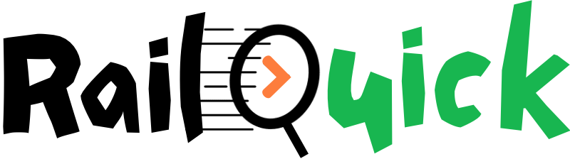

<div align="center">
  
  
  # 🚄 RailQuick
  **Your ultimate in-journey train delivery & assistance platform**
  
  [](https://nodejs.org/)
  [](https://supabase.com/)
  [](https://clerk.dev/)
  [](LICENSE)
</div>

---

## 📖 About the Project

**RailQuick** is a modern, mobile-first web application designed to redefine the train travel experience in India. It empowers train passengers to seamlessly check their PNR status, track their trains in real-time, and get essential items—ranging from food and beverages to electronics and personal care products—delivered directly to their seat during their journey.

The current application serves as a comprehensive **Waitlist and Early Access Portal**, combined with a fully interactive mockup of the upcoming application features. Users can join the waitlist, explore the interface, and manage their mock profile seamlessly.

---

## ✨ Key Features

* **🚂 Live Train Tracking**: Mockup of real-time GPS-based tracking of trains running across the railway network.
* **🎫 PNR Status Check**: Instantly verify your PNR confirmation chances and passenger statuses.
* **🛍️ In-Train Delivery Store**: Browse a wide catalogue of:
  * Food & Beverages (Local specials, snacks, hot meals)
  * Personal Care & Hygiene products
  * Electronics (Chargers, earphones)
  * Travel Essentials (Neck pillows, eye masks)
* **🔐 Secure Authentication**: Integrated OTP-based Email authentication utilizing Clerk & Supabase.
* **👤 User Profile Management**: Persistent profile saving (Name, Phone Number, Date of Birth) synchronized dynamically.
* **📱 Responsive Mobile-First UI**: Beautiful, intuitive, and fluid interface tailored for smartphone browsers.

---

## 🛠️ Tech Stack

* **Frontend**: HTML5, Vanilla JavaScript, CSS3 (Tailwind-inspired utility structure)
* **Backend**: Node.js (Core `http` module for routing and API handling)
* **Database & Auth**: 
  * [Supabase](https://supabase.com/) (PostgreSQL & Waitlist Management)
  * [Clerk](https://clerk.dev/) (User Identity & OTP Auth)
* **Email Service**: [Resend](https://resend.com/) (Transactional emails for the Waitlist)

---

## 🚀 Getting Started

Follow these instructions to set up the project locally on your machine.

### Prerequisites
* [Node.js](https://nodejs.org/en/download/) (v16.x or higher)
* [npm](https://www.npmjs.com/) (comes with Node.js)

### Installation

1. **Clone the repository**
   ```bash
   git clone https://github.com/yourusername/railquick-app.git
   cd railquick-app
   ```

2. **Environment Configuration**
   Create a `.env` file in the root directory and configure the necessary keys:
   ```env
   PORT=3000
   HOST=127.0.0.1
   SUPABASE_URL=your_supabase_url
   SUPABASE_ANON_KEY=your_supabase_anon_key
   RESEND_API_KEY=your_resend_api_key
   RESEND_FROM=RailQuick <onboarding@resend.dev>
   RAILKIT_API_KEY=your_railkit_api_key
   ```

3. **Database Setup (Supabase)**
   Execute the following SQL in your Supabase SQL Editor to create the waitlist table:
   ```sql
   create table waitlist (
     id uuid primary key default gen_random_uuid(),
     email text unique not null,
     city text not null,
     created_at timestamptz not null default now()
   );
   ```
   *(Ensure you enable proper Row Level Security (RLS) policies for anonymous inserts).*

4. **Run the Application**
   Start the local development server without needing heavy bundlers:
   ```bash
   npm run dev
   # or
   node server.js
   ```

5. **Open in Browser**
   Navigate to `http://localhost:3000` or `http://127.0.0.1:3000` to view the app.

---

## 🤝 Contributing

Contributions are what make the open-source community such an amazing place to learn, inspire, and create. Any contributions you make are **greatly appreciated**.

1. Fork the Project
2. Create your Feature Branch (`git checkout -b feature/AmazingFeature`)
3. Commit your Changes (`git commit -m 'Add some AmazingFeature'`)
4. Push to the Branch (`git push origin feature/AmazingFeature`)
5. Open a Pull Request

---

## 📜 License

Distributed under the MIT License. See `LICENSE` for more information.

---
<div align="center">
  <i>Built with ❤️ for better journeys.</i>
</div>
